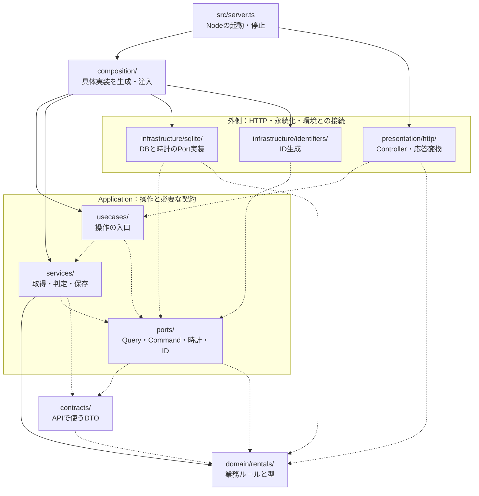
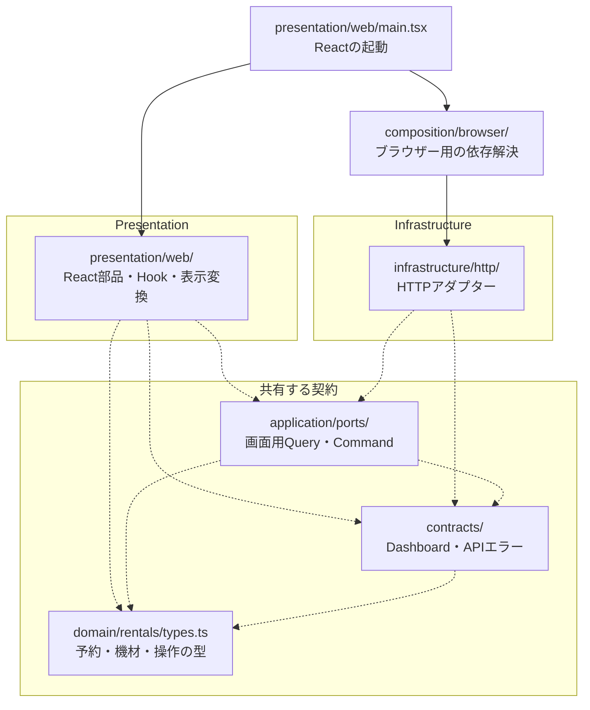
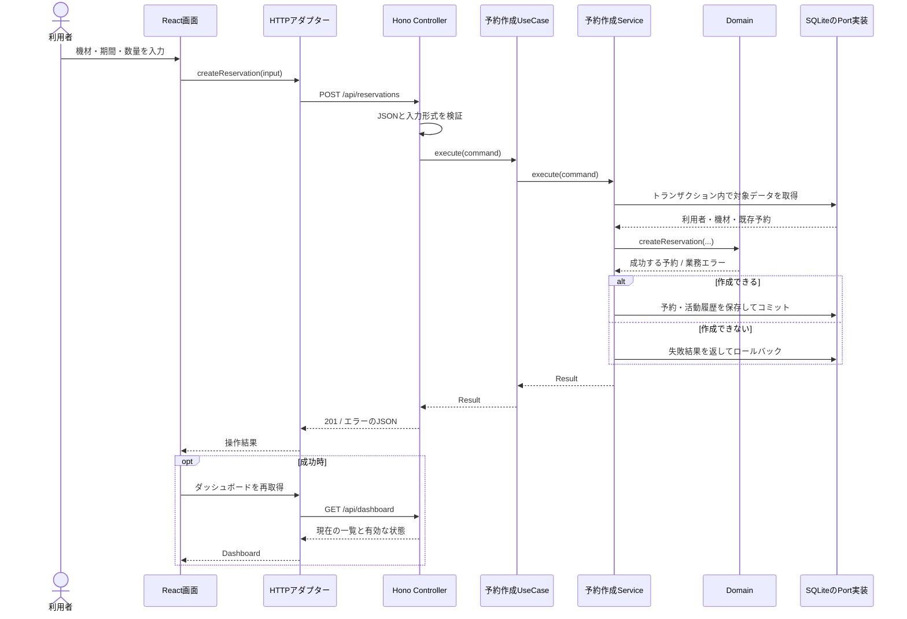

# 機材レンタル管理のアーキテクチャサンプル

[](https://github.com/Rohiona/typescript-architecture-sample/actions/workflows/ci.yml)

**予約できるか、なぜできないかを、コードと画面の両方で説明する。**

機材レンタルの予約・貸出を題材にした、ローカルで動くTypeScriptアーキテクチャサンプルです。
架空の利用者と機材を使い、予約の判定・保存・貸出・返却は実際に動作します。
APIキーや別のDBサーバーは不要です。画面の名称は「RENTAL DESK」です。


設計の中心は、具体的な判断を直接テストできることです。
Controller・UseCase・Service・Domainの分担、用途別のQuery／Command Port、
SQLiteの保存処理まで、画面を操作しながらコードを追えます。

[起動する](#起動する) · [デモ](#デモの進め方) · [依存関係](#パッケージの依存関係) ·
[実行フロー](#画面から保存までの実行フロー) · [配置](#ディレクトリの責務) ·
[技術](#技術スタックと採用理由) · [APIとDB](#apiとデータの保存) · [品質](#品質チェック)

## 起動する

Node.js 24を使用します。CIもNode.js 24です。

```sh
git clone https://github.com/Rohiona/typescript-architecture-sample.git
cd typescript-architecture-sample
npm ci
npm run dev
```

[アプリを開く](http://127.0.0.1:5173/)。
画面は5173、APIは3001で起動し、Viteが `/api` をAPIサーバーへ転送します。
初回起動時にSQLiteのテーブルとサンプルデータを作成します。
以後は `.data/rentals.db` に保存され、再起動しても操作結果を保持します。停止は Ctrl+C。

### ビルドした画面を配信する

```sh
npm run build
npm start
```

この場合は [ポート3001](http://127.0.0.1:3001/) を開きます。
Viteが生成した `dist/client/` の画面とAPIを同じNodeサーバーから配信します。
サーバーのTypeScriptは `tsx` で実行します。

| 設定      | 既定値             | 用途                                                                  |
| --------- | ------------------ | --------------------------------------------------------------------- |
| `HOST`    | `127.0.0.1`        | 通常起動時の待受アドレス                                              |
| `PORT`    | `3001`             | APIとビルド済み画面の待受ポート                                       |
| `DB_PATH` | `.data/rentals.db` | SQLiteファイルの場所。`:memory:` ならプロセス終了時に消えるメモリ内DB |

開発時にAPIのポートを変更する場合は、[Viteのproxy](vite.config.ts) も合わせます。
IDE設定・DB・生成物は [.gitignore](.gitignore) で除外します。
IntelliJの `.idea/`・`*.iml`、VS Codeの `.vscode/` も管理対象外です。

### Docker Composeで起動する

DockerとComposeがある場合は、Node.jsをホストへ入れずに起動できます。
リポジトリをcloneしたディレクトリで実行します。

```sh
docker compose up --build -d
```

[アプリを開く](http://127.0.0.1:3001/)。
初回は依存の導入とビルドに時間がかかります。
`docker compose logs -f app` でログを確認できます。
通常のnpm起動と同じ3001を使うため、同時には起動できません。

[Dockerfile](Dockerfile) はビルド段階と実行段階を分け、
実行時は非rootの `node` ユーザーを使います。
[compose.yaml](compose.yaml) では、コンテナ内は `HOST=0.0.0.0`、
ホスト側の公開先は `127.0.0.1:3001` です。
SQLiteは名前付きボリューム `rental-data` に保存し、
npm起動時の `.data/rentals.db` とは別に保持します。

```sh
docker compose down
```

コンテナを削除してもボリュームのデータは残り、次回起動時に引き継がれます。
データも含めて初期状態へ戻す場合：

```sh
docker compose down -v
```

**`-v` は、このComposeプロジェクトのボリュームと保存されたデモDBを削除します。**
次回起動時に初期データを作り直します。
[Composeの停止・ボリューム削除](https://docs.docker.com/reference/cli/docker/compose/down/)

## デモの進め方

画面上部で、利用者・スタッフを切り替えられます。
時刻は実時間ではなく、**2026年9月14日 9:00 JSTから始まるデモ用の時計**です。
「+15分」「+1時間」で進められ、「初期化」でデータと時計を元に戻せます。

1. 高橋 凛のまま、カメラを10:00〜12:00で仮予約します。
2. 佐藤 海斗に切り替え、同じ時間にカメラを予約します。在庫不足で拒否されます。
3. 時刻を15分進めると、最初の仮予約が期限切れになります。
4. 佐藤 海斗でカメラを仮予約し、15分以内に「予約を確定」を押します。
5. 貸出スタッフへ切り替え、時刻を開始時刻まで進めます。
6. 「貸出管理」で貸し出し、返却を受け付けます。

機材はカメラ1台、プロジェクター2台、三脚3台です。
プロジェクターには13:00〜14:00の点検があり、最初から予約も入っています。
データの正本は [demo-seed.ts](src/infrastructure/sqlite/demo-seed.ts) です。

利用者の切り替えはデモ操作であり、ログイン・本人確認ではありません。
同じサーバーへ接続する画面はデータと時計を共有します。

### 実装している業務ルール

| ルール         | このサンプルでの扱い                                                   |
| -------------- | ---------------------------------------------------------------------- |
| 予約期間と数量 | 開始は現在以降、終了は開始より後。数量は正の安全な整数                 |
| 日時           | 内部はepochミリ秒、画面の入力・表示はJST                               |
| 仮予約         | 作成から15分。期限時刻ちょうどから失効し、在庫を確保しなくなる         |
| 確定           | 有効な仮予約で、利用終了時刻より前に行う                               |
| 在庫           | 予約期間に同時に必要な最大台数が、保有台数を超えないこと               |
| 準備時間       | 申込期間と既存予約の両方に、返却後の準備時間を含める                   |
| 点検           | 準備時間も含めて点検期間と重なる予約は受け付けない                     |
| 貸出中         | 返却されるまで終了未定の占有とみなし、将来予約も保守的に制限する       |
| 返却           | 実際の返却時刻＋準備時間まで占有する                                   |
| 状態遷移       | 仮予約→確定→貸出中→返却済み。取消は仮予約・確定からのみ                |
| 権限           | 利用者は自分の確定・取消、スタッフは全予約の操作と貸出・返却           |
| 貸出可能時間   | 確定済みで、開始時刻以上・終了時刻未満のとき                           |
| 実物の確認     | 貸出時に未返却・準備中の台数も調べ、予約済みでも実物が足りなければ拒否 |

期間は `[開始, 終了)` です。準備時間を含む終了と次の開始が同じなら重複しません。
「重なっている予約の台数を全部足す」計算では、前後に連続する予約を二重に数えてしまいます。
[最大同時数量](src/domain/rentals/concurrent-quantity.ts) は開始・終了のイベントを時刻順に処理して判定します。

これらはサンプルとして決めた業務仕様です。実際のレンタル業務へ導入する場合は、運用に合わせて見直します。

## 設計

### 各層が担当すること

| 層・役割                  | 担当すること                                            | このアプリの例                                                   |
| ------------------------- | ------------------------------------------------------- | ---------------------------------------------------------------- |
| Presentation / Controller | UIとの同期、HTTP入力・出力への変換、UseCaseへの引き渡し | JSONをZodで検証し、結果を201や409の応答にする                    |
| Application / UseCase     | 操作の入口と実行手順を揃える                            | 予約作成Serviceへ依頼し、その結果を返す                          |
| Application / Service     | 操作に必要なデータを揃え、具体処理・保存をまとめる      | トランザクション内で機材・予約を取得し、Domainで判定して保存する |
| Domain                    | DB・HTTP・画面に依存しない業務ルール                    | 予約期限、期間の重複、在庫、権限、状態遷移                       |
| Application / Port        | 必要な外部操作を用途別の契約として定義する              | 予約を保存する、ダッシュボードを読む、現在時刻を得る             |
| Infrastructure            | Portを実際の技術で実装する                              | SQLite、HTTP通信、UUID生成                                       |
| Composition               | 具体実装を生成して、必要な相手へ渡す                    | SQLiteのPortをServiceへ、ServiceをUseCaseへ注入する              |

現在のUseCaseの多くは、1つのServiceへ渡す薄い入口です。
具体的な在庫判定をUseCaseへ置かず、Serviceの公開メソッドやDomainの公開関数を直接テストします。
トランザクションを伴う取得・判定・保存はServiceに集めています。
デモ初期化は追加の業務判定がないため、UseCaseから専用Portを呼びます。

### パッケージの依存関係

ここでの「パッケージ」は `src/` 配下のディレクトリ単位です。複数のnpmパッケージに分割してはいません。
**矢印は「importする側 → importされる側」**です。
実線は実行時にも残るimport、破線は `import type` など型だけの依存を示します。
通信や処理の実行順は、後の実行フロー図で表します。外部ライブラリと同じパッケージ内の依存は省略しています。

#### サーバー側



Domainから上位層への依存はありません。
ServiceはSQLiteの実装をimportせず、ApplicationにあるPortの型を知っています。
Infrastructure側がそのPortを実装するため、DBを使う実行順と、コードの依存方向が異なります。

UseCase→Service、Controller→UseCaseが破線なのは、注入されたオブジェクトを呼び、
型だけをimportしているためです。具体的なインスタンスの生成はCompositionにあります。
図のController→UseCaseは `http-usecases.ts` を通した型の参照をまとめています。

#### ブラウザー側



Reactの部品はPortを受け取り、HTTPアダプターを直接生成しません。
`main.tsx` は起動点としてCompositionを呼ぶ例外です。
ブラウザー側とサーバー側の間に、Controllerをimportする線はありません。
APIとはHTTPで通信し、共有するTypeScriptの型は通信内容を記述します。

### CQRSと依存の注入

CQRSは、**用途ごとの取得と更新の契約を分ける**ために使っています。
読み取り専用DBや非同期の複製は導入せず、同じSQLiteを使います。

| 利用する側 | 読み取り                                                                                                                   | 更新                                                                                                                                        |
| ---------- | -------------------------------------------------------------------------------------------------------------------------- | ------------------------------------------------------------------------------------------------------------------------------------------- |
| ブラウザー | [DashboardQueryPort](src/application/ports/dashboard-query-port.ts)                                                        | [ReservationCommandPort](src/application/ports/reservation-command-port.ts)、[DemoCommandPort](src/application/ports/demo-command-port.ts)  |
| サーバー   | [RentalQueryPort](src/application/ports/rental-query-port.ts)、[ClockQueryPort](src/application/ports/clock-query-port.ts) | [RentalCommandPort](src/application/ports/rental-command-port.ts)、[DemoStateCommandPort](src/application/ports/demo-state-command-port.ts) |

Command側の `RentalTransaction` にも読み取りメソッドがあります。
これは更新の可否を同じトランザクション内で判断するためです。
一覧表示向けのQueryと、更新を成立させるための読み取りを分けています。

依存はfactoryの引数から渡します。DIコンテナやService Locatorは使っていません。
時計とID生成もPortにしたため、テストで15分の経過を待ったり、生成されたIDを予測したりする必要がありません。
UIテストではHTTPアダプターをfakeのPortへ差し替えられます。

### 画面から保存までの実行フロー

次の図は仮予約を作るときの**通信・処理の流れ**です。importの依存関係図とは別です。



実際の保存処理は、SQLiteの即時書き込みトランザクションで
**read-check-write全体を囲みます**。
Domainは値を返すだけで、DBの更新やコミットをしません。
詳細は [予約作成Service](src/application/services/reservations/create/create-reservation-service-factory.ts) と
[トランザクション実装](src/infrastructure/sqlite/atomic-transaction.ts) から追えます。

読み取り時はQuery Serviceが一覧を取得し、注入された時計とDomainの判定から
`effectiveStatus` を付けた [Dashboard](src/contracts/dashboard.ts) を返します。
仮予約の期限切れは読み取り時にも判定するため、失効させるための定期ジョブはありません。

## ディレクトリの責務

「どんなファイルを置く場所か」を基準に分けています。
機能が大きくなる場所は **層 → 機能 → 処理の目的** の順です。
例えば `application/services/reservations/create/` は予約作成の具体処理を置く場所です。

| 場所                                                                           | 置くファイル・責務                                                                 |
| ------------------------------------------------------------------------------ | ---------------------------------------------------------------------------------- |
| [src/domain/rentals/](src/domain/rentals/)                                     | 予約・機材の型、期限・期間・在庫・状態遷移など、外部I/Oを持たないルール            |
| [src/application/usecases/](src/application/usecases/)                         | 予約作成・予約変更・一覧取得・デモ操作の入口を揃えるUseCase                        |
| [src/application/services/](src/application/services/)                         | Portを使う操作処理、取得した値の組み立て、具体的な判定・変換                       |
| [src/application/ports/](src/application/ports/)                               | 読み取り・更新・時計・ID生成に必要なinterfaceと入出力の型                          |
| [src/contracts/](src/contracts/)                                               | HTTP応答として共有するDTO。Dashboard、表示上の予約状態、APIエラー                  |
| [src/infrastructure/sqlite/](src/infrastructure/sqlite/)                       | DB接続、Drizzleの定義、Query／Command Port、トランザクション、デモ時計・初期データ |
| [src/infrastructure/sqlite/migrations/](src/infrastructure/sqlite/migrations/) | 実際のテーブル・制約を作るSQL。適用済みバージョンはDBに記録                        |
| [src/infrastructure/http/](src/infrastructure/http/)                           | ブラウザーからAPIを呼ぶPort実装、JSON通信と通信エラーの変換                        |
| [src/infrastructure/identifiers/](src/infrastructure/identifiers/)             | UUIDを生成するIdentifier Port実装                                                  |
| [src/composition/](src/composition/)                                           | サーバー用のDB・Port・Service・UseCaseを生成して接続するfactory                    |
| [src/composition/browser/](src/composition/browser/)                           | ブラウザー用のHTTPクライアントとQuery／Commandを生成するfactory                    |
| [src/presentation/http/](src/presentation/http/)                               | Honoのルート、Zod入力スキーマ、リクエスト解析、HTTP応答への変換                    |
| [src/presentation/web/](src/presentation/web/)                                 | React画面・部品・Hook、JST表示への変換、CSS、ブラウザーの起動点                    |
| [src/server.ts](src/server.ts)                                                 | Nodeサーバーの起動・環境設定・静的ファイル配信・終了時処理                         |
| [tests/](tests/)                                                               | Domain・Application・DB・HTTP・UI・品質ゲート・ブラウザー操作のテスト              |
| [scripts/](scripts/)                                                           | カバレッジの独自判定など、アプリの外で使う開発用処理                               |
| [.github/workflows/](.github/workflows/)                                       | PRとmain更新時の品質・ブラウザー・コンテナのチェック                               |
| [Dockerfile](Dockerfile) / [compose.yaml](compose.yaml)                        | 再現可能なコンテナ起動、実行ユーザー、ポートとDBボリュームの設定                   |

振る舞いを持つインスタンスを生成する関数は `*-factory.ts` に置きます。
独立した判断は、例えば [available-physical-quantity.ts](src/application/services/reservations/change/available-physical-quantity.ts)
のような目的の分かる名前の公開関数にし、直接テストします。

## 技術スタックと採用理由

バージョンの正本は [package-lock.json](package-lock.json)、コマンドと直接依存の宣言は
[package.json](package.json) です。以下はlockfileで解決された版です。

### アプリを動かす技術

| 技術                       | バージョン       | このサンプルでの用途・採用理由                                                   |
| -------------------------- | ---------------- | -------------------------------------------------------------------------------- |
| Node.js                    | 24系             | 画面とAPIをローカル起動する実行環境。CIのLinux・Windowsも同じ系列                |
| TypeScript                 | 7.0.2            | UI・API・業務ルールの型を同じ言語で扱い、Portの契約をコンパイル時に確認する      |
| React / React DOM          | 19.3.0 / 19.3.0  | 部品と状態を組み合わせ、操作後の一覧・入力・エラーを同期する                     |
| Vite / React plugin        | 8.3.0 / 6.1.1    | 開発サーバーとAPI proxy、配信用の画面をビルドする                                |
| Hono / Node server adapter | 4.13.7 / 2.1.1   | 小さなHTTP入口を作り、Controllerを業務ルールから分離する                         |
| SQLite / better-sqlite3    | ドライバー13.0.3 | 別DBサーバー不要のファイル保存。同期トランザクションで予約の確認と更新をまとめる |
| Drizzle ORM                | 0.45.2           | テーブルとSQL操作をTypeScriptで記述する。DB固有の型はInfrastructure内に置く      |
| Zod                        | 4.6.2            | HTTPで届く未知の値を実行時に検証し、型がある入力へ変換する                       |
| Lucide React               | 1.45.0           | ボタンや状態表示のアイコンを揃える                                               |
| tsx                        | 4.23.13          | 開発時の監視実行とNodeサーバーのTypeScript実行                                   |
| concurrently               | 10.0.5           | 開発用の画面とAPIを1コマンドで起動・停止する                                     |

SQLiteの欄はnpmドライバーの版を示しており、SQLiteエンジン自体の版ではありません。
画面の「機材一覧」「予約一覧」「貸出管理」はReactの表示切り替えです。
APIのURLルーティングはHonoが担当し、フロント側のルーティングライブラリは導入していません。

### テスト・開発支援の技術

| 技術                               | バージョン        | 用途                                                                   |
| ---------------------------------- | ----------------- | ---------------------------------------------------------------------- |
| Vitest / V8 coverage               | 5.0.0 / 5.0.0     | 単体・連携テストとDomainのカバレッジ計測                               |
| Testing Library React / user-event | 16.3.3 / 14.6.7   | 利用者に見える要素を探し、入力・クリックを再現する                     |
| jsdom                              | 30.0.1            | Node上のReactテストにDOM環境を用意する                                 |
| Playwright                         | 1.63.0            | Chromiumから実APIとDBを通す操作テスト                                  |
| Oxlint / tsgolint                  | 1.82.0 / 7.0.2001 | 型情報を使うLint。非推奨API、PromiseやHooksの問題などを検出する        |
| Oxfmt                              | 0.67.0            | インデントや改行を統一する                                             |
| dependency-cruiser                 | 18.2.0            | importから依存関係を解析し、層の境界や循環を検査する                   |
| Knip                               | 6.35.1            | 入口から参照をたどり、未使用ファイル・export・依存パッケージを検出する |
| Babel core / TypeScript preset     | 7.29.7 / 7.29.7   | dependency-cruiserのTypeScript解析を補助する                           |

型定義は `@types/node` 24.13.4、`@types/react` 19.3.0、
`@types/react-dom` 19.3.0、`@types/better-sqlite3` 9.6.0です。
これらはコンパイラー向けの型情報であり、実行ライブラリの版とは別です。

## APIとデータの保存

### HTTPの入口を読む

ルートは [rental-http-app-factory.ts](src/presentation/http/rental-http-app-factory.ts)、
入力項目は [request-schemas.ts](src/presentation/http/request-schemas.ts) にあります。

| メソッド・パス                       | 入力                                             | 成功時の応答                                  |
| ------------------------------------ | ------------------------------------------------ | --------------------------------------------- |
| `GET /api/health`                    | なし                                             | `{ status: "ok" }`                            |
| `GET /api/dashboard`                 | なし                                             | 時刻・利用者・機材・予約・活動履歴のDashboard |
| `POST /api/reservations`             | `actorId, equipmentId, quantity, startAt, endAt` | 201、`{ reservation }`                        |
| `POST /api/reservations/:id/actions` | `actorId, action`                                | 200、`{ reservation }`                        |
| `POST /api/demo/advance`             | `minutes`（1〜1440の整数）                       | 200、`{ now }`                                |
| `POST /api/demo/reset`               | なし                                             | 200、`{ ok: true }`                           |

予約作成・状態変更・時刻変更は `Content-Type: application/json` のJSONを受け取ります。
`startAt` と `endAt` はepochミリ秒、`action` は
`confirm`・`cancel`・`check_out`・`return` のいずれかです。
APIのデモ時計は1〜1440分を受け取り、画面では15分と60分のボタンを用意しています。

Zodは入力の形式を、Domainは期間・在庫・状態遷移などの業務条件を検証します。
想定する業務上の失敗は `Result<T>` で返し、
[send-result.ts](src/presentation/http/send-result.ts) と
[error-status.ts](src/presentation/http/error-status.ts) がHTTP応答へ変換します。

エラー本文は `{ error: { code, message } }` です。
入力不正は400、権限不足は403、対象なしは404、在庫不足・状態の競合などは409に対応します。
予期しない例外はControllerの共通処理で500になります。
HTTPの型を共有していてもJSONの実行時検証が自動で付くわけではなく、
ブラウザー側の成功応答は現状、API契約に従う前提で受け取っています。

### DBに保存するもの

| テーブル            | 保存する内容                                             |
| ------------------- | -------------------------------------------------------- |
| `customers`         | 架空の利用者・スタッフと役割                             |
| `equipment`         | 機材、保有台数、返却準備時間、点検期間                   |
| `reservations`      | 期間・数量・状態、仮予約期限、実返却時刻、更新バージョン |
| `activities`        | 操作時刻と活動メッセージ                                 |
| `demo_clock`        | 全画面で共有するデモ用の現在時刻                         |
| `schema_migrations` | 適用済みSQLマイグレーションのバージョン                  |

接続時に [migrate.ts](src/infrastructure/sqlite/migrate.ts) が未適用SQLを実行し、
デモ時計が未作成なら初期データを投入します。
テーブルの作成・制約は [SQLマイグレーション](src/infrastructure/sqlite/migrations/0001-initial.sql)、
TypeScriptでのアクセス定義は [schema.ts](src/infrastructure/sqlite/schema.ts) にあります。
Drizzleの定義を書き換えるだけでは、既存DBのテーブルは変更されません。

保存される `status` と、応答の `effectiveStatus` は区別します。
例えば期限切れになった仮予約も、DB上は `held` のまま、
現在時刻から求めた有効状態として `expired` を返します。

### 同時予約と更新の整合性

在庫確認と保存は、SQLiteの書き込みロックを最初に取る `immediate` トランザクションで行います。
予約の更新では `version` が直前の値と一致することも確認します。
失敗結果や例外が発生すれば、予約と活動履歴をまとめてロールバックします。
デモ初期化も、削除と初期データの再投入を同じトランザクションに含めます。

この部分は実DBのテストで確認します。
[sqlite-rentals.test.ts](tests/infrastructure/sqlite-rentals.test.ts) には、
2接続の排他、同じ空き状況を見た後の競合、古いバージョンの拒否、
失敗時のロールバック、DB再接続後の保存データの確認があります。

## テストから読む・機能を拡張する

### 読みたい処理から辿る

| 確認したいこと                     | 実装の入口                                                | 対応するテスト                                                                       |
| ---------------------------------- | --------------------------------------------------------- | ------------------------------------------------------------------------------------ |
| 連続予約を二重に数えない           | [最大同時数量](src/domain/rentals/concurrent-quantity.ts) | [concurrent-quantity.test.ts](tests/domain/concurrent-quantity.test.ts)              |
| 15分の期限、取消・貸出・返却の境界 | [状態遷移](src/domain/rentals/transition-reservation.ts)  | [transition-reservation.test.ts](tests/domain/transition-reservation.test.ts)        |
| Port取得・判定・保存、実物の不足   | [予約Service](src/application/services/reservations/)     | [reservation-services.test.ts](tests/application/reservation-services.test.ts)       |
| UseCaseが依頼と結果を正しく渡す    | [UseCase](src/application/usecases/)                      | [dashboard-demo-usecases.test.ts](tests/application/dashboard-demo-usecases.test.ts) |
| DBの制約・競合・ロールバック       | [SQLite実装](src/infrastructure/sqlite/)                  | [sqlite-rentals.test.ts](tests/infrastructure/sqlite-rentals.test.ts)                |
| JSON入力・HTTPステータス           | [HTTP Controller](src/presentation/http/)                 | [rental-http.test.ts](tests/http/rental-http.test.ts)                                |
| 画面操作・通信失敗・表示更新       | [React画面](src/presentation/web/)                        | [UIテスト](tests/ui/)                                                                |
| 画面からDBまでの貸出フロー         | [ブラウザーテスト](tests/e2e/rental-flow.spec.ts)         | 実サーバーを使うPC・スマホのシナリオ                                                 |

### 変更を置く場所

1. **業務ルールを変える**：Domainの公開関数と境界条件のテストを更新します。
   必要なデータの取得・保存が増える場合はServiceとPortを拡張します。
2. **操作を増やす**：機能・目的ごとにServiceとUseCaseを作り、Compositionで接続します。
   HTTPの入力・応答はController、画面からの呼び出しは用途別のPortとHTTPアダプターへ置きます。
3. **保存項目を増やす**：新しいSQLマイグレーションを追加して適用一覧へ登録し、
   Drizzleの定義・Port実装・必要なDomain／DTOの型を合わせ、実DBで移行と保存を確認します。
4. **画面だけを変える**：React部品やHook、表示変換とUIテストを変更します。
   業務上の許可・拒否はサーバー側でも判定するため、ボタンの表示だけでルールを保証しません。
5. **外部技術を替える**：Portを満たす別アダプターを作り、Compositionの接続を変更します。
   現在のサーバーPortは同期処理なので、非同期DBへ替える場合はPortと呼び出し側の非同期化も検討します。

## 品質チェック

具体ロジックには判断・境界条件の詳細テスト、UseCaseには呼び出しの疎通テストを置きます。
プロジェクト全体のカバレッジ目標は設けず、
**Domainは各ファイルの行・文・分岐・関数をすべて100%**にします。

### 各ツールで何を確認するか

| チェック                                | 検出すること・例                                                          | 実行場所                       |
| --------------------------------------- | ------------------------------------------------------------------------- | ------------------------------ |
| TypeScript                              | 型の不整合、存在しないプロパティ、未使用のローカル変数・引数              | PR CI                          |
| Oxfmt                                   | インデント・改行などの不統一。CIでは整形済みか確認                        | PR CI、整形はローカル          |
| Oxlint + tsgolint                       | 非推奨API、未使用import、`any`、未処理Promise、Hooksの違反。警告も0件必須 | PR CI                          |
| Oxlintの境界ルール + dependency-cruiser | 型・値・動的importの層違反、実行時循環、解決できないimport                | PR CI                          |
| Knip                                    | 未使用ファイル・export・依存パッケージ、未宣言の依存など                  | PR CI                          |
| Vitest                                  | 入出力・状態遷移・保存などがテストの期待どおりか                          | PR CI、必要な範囲はローカル    |
| Testing Library + jsdom                 | Reactの入力・クリック・エラー表示など                                     | Vitest内                       |
| V8カバレッジ + 独自ゲート               | Domainの4指標100%、未計測・skip・除外指示・丸めの見逃し                   | PR CI                          |
| 品質ゲート自身のテスト                  | 不完全なカバレッジや依存違反を拒否し、正しい構成を許可すること            | Vitest内                       |
| Viteビルド                              | 配信用の画面を生成できること                                              | PR CI                          |
| Playwright                              | Chromiumと実API・DBをつないだ操作シナリオ                                 | CIの別ジョブ、必要時はローカル |
| Docker Compose + コンテナ検証           | ビルドした画面・API・非root実行・コンテナ再作成後のDB保持                 | CIの別ジョブ                   |

**書式と静的解析**：Oxfmtは書式を整えるフォーマッター、Oxlintはコードの問題を調べるLintです。
[Oxfmt設定](.oxfmtrc.json) の `printWidth: 120` は折り返しの目安で、
長いURLや文字列などを必ず120文字以内に分割する制約ではありません。
[Oxfmt公式設定](https://oxc.rs/docs/guide/usage/formatter/config-file-reference)

[Oxlint設定](.oxlintrc.json) では型情報も使い、不要になった抑制指示もエラーにします。
非推奨APIの検出は型定義などの `@deprecated` が根拠です。
印のない廃止予定APIやパッケージの古さを検出する機能とは異なります。
DomainとApplicationでは、グローバルの `Date`・`fetch`・`localStorage` を直接使うコードも拒否し、
時刻や通信を引数・Portから渡す方針を支えます。
[非推奨API検出の公式説明](https://oxc.rs/docs/guide/usage/linter/rules/typescript/no-deprecated.html)

**依存関係と未使用コード**：層の境界は2つの検査で確認します。
Oxlintは静的なimport・再exportを型だけの参照も含めて検査し、
Domainから他層、ApplicationからInfrastructure、ServiceからUseCaseなどへの依存を拒否します。
PresentationからInfrastructure・Compositionへの依存も拒否し、
ブラウザーの起動点 `main.tsx` からCompositionへの接続だけを例外にします。

[dependency-cruiser設定](.dependency-cruiser.cjs) は動的importも含む実行時依存、
循環、解決不能なimportを検査します。型だけのimportは実行時循環の対象外です。
[境界ルールのテスト](tests/quality/architecture-gates.test.ts) では実際の検査コマンドを使い、
禁止された型参照・値参照・再export・動的importの拒否と、正しい依存の許可を確認します。
[dependency-cruiser公式ルール](https://github.com/sverweij/dependency-cruiser/blob/main/doc/rules-reference.md)

TypeScriptやLintが見つけるローカルな未使用に加え、[Knip設定](knip.json) で入口から参照を辿ります。
サーバー・ブラウザー・スクリプトを入口として設定し、テストも解析します。
テストだけから使う公開ルールも意図した利用です。未使用かどうかは設定された入口と静的解析の範囲に依存するため、
動的な参照や新しい起動点を増やす場合は設定も確認します。

**Domainカバレッジ**：[Vitest設定](vitest.config.ts) では、
テストから読み込まれていないDomainファイルも計測対象にします。
[独自ゲート](scripts/check-domain-coverage.mjs) は表示上の百分率ではなく、
各指標の実件数 `covered === total` と `skipped === 0` を確認します。
未計測ファイル、不正な件数、カバレッジ除外コメントも拒否します。

型宣言ファイル `*.d.ts` は対象外です。型だけを含む通常の `*.ts` は、
実行箇所が0件でもレポートへの掲載が必要です。
[ゲート自身のテスト](tests/quality/coverage-gate.test.ts) で、丸めによる100%、未計測やskipなどの見逃しを検証します。
[Vitestカバレッジの公式説明](https://vitest.dev/guide/coverage.html)

カバレッジは実行された範囲の指標であり、期待値の正しさや入力の全組み合わせを保証しません。
DBの競合・権限・境界条件はテスト内容とレビューでも確認します。
ミューテーションテストは、コードを意図的に変えてテストの検出力を調べる手法です。
このサンプルには実行ツールやコマンドを導入していません。

**画面の確認**：jsdomは実ブラウザーの描画・レイアウトとは別です。
Playwrightでは実サーバーを起動し、PCの貸出フローとスマホの操作を確認します。
現在のブラウザージョブはChromiumが対象で、すべてのブラウザーや画面幅を保証するものではありません。
見た目や操作性の変更は、対象画面でも確認します。

### PRとCIの進め方

1. 変更に合ったテストを整備し、必要な範囲をローカルで確認します。
2. PRを作成・更新すると [Quality workflow](.github/workflows/ci.yml) が `npm ci` で依存を入れます。
3. Linux・WindowsのNode.js 24で `npm run check` を実行し、
   別のLinuxジョブでビルドとChromiumのE2E、Composeの起動・保存確認を実行します。
4. 失敗した項目を修正してpushし、**最新コミット**のCIがすべて成功したことを確認してからマージします。
   閾値を下げたり検査を無効化したりして通しません。

コンテナの検証は [check-container.mjs](scripts/check-container.mjs) で行い、CI専用のComposeプロジェクトを使います。
検証後はそのプロジェクトのボリュームを削除します。

main更新時も同じ品質ワークフローが動きます。公開サービスへの自動デプロイは設定していません。
CIで同等に確認できる全体チェックはPR CIへ集約し、ローカルでは実装・失敗の切り分けに必要な範囲を実行します。

### 必要なときに使うコマンド

| コマンド                               | 用途                                                              |
| -------------------------------------- | ----------------------------------------------------------------- |
| `npm run format`                       | 書式を整える                                                      |
| `npm run typecheck`                    | TypeScriptの型検査                                                |
| `npm run lint`                         | Lint・依存関係・未使用コード                                      |
| `npm run test -- tests/domain`         | Domainのテストだけを実行                                          |
| `npm run test -- tests/<対象>.test.ts` | 対象を指定してテスト                                              |
| `npm run test:watch`                   | 編集しながらテストを継続実行                                      |
| `npm run test:coverage`                | VitestとDomain100%の独自判定                                      |
| `npm run check`                        | 書式・型・Lint・テスト・Domainカバレッジ・画面ビルド。通常はPR CI |
| `npm run test:e2e`                     | 別途ビルドした画面でブラウザー操作を確認                          |

`npm run check` にE2Eは含まれません。E2Eを初めて実行する場合：

```sh
npx playwright install chromium
npm run build
npm run test:e2e
```

Linuxでシステムライブラリが不足する場合は
[Playwrightの導入手順](https://playwright.dev/docs/browsers#install-system-dependencies) を参照してください。
[Playwright設定](playwright.config.ts) は専用ポート3123とメモリ内DBを使い、
普段のローカルDBを変更しません。
